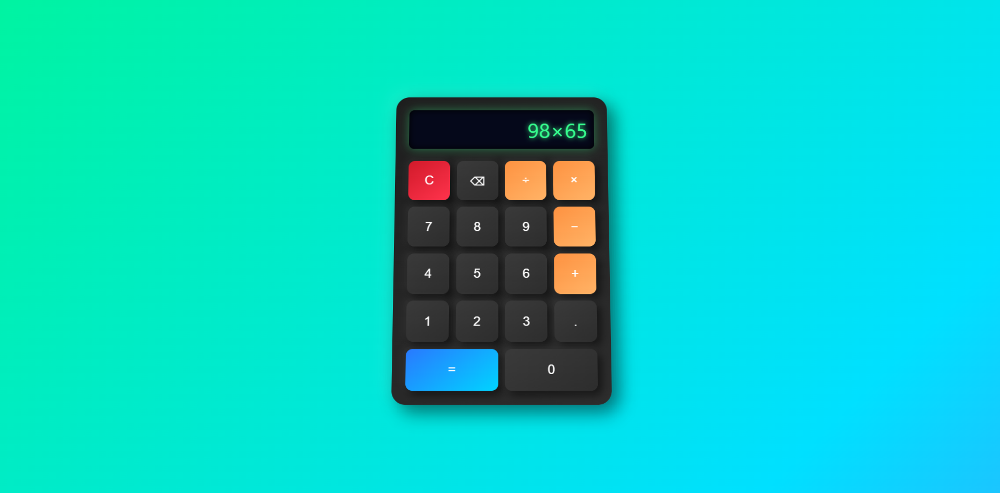

# 🧮 Talking Calculator (Alexa Voice Edition)

A futuristic **voice-interactive calculator** built with **HTML, CSS, and JavaScript**.  
This calculator doesn’t just calculate — it **talks back** like Alexa! 🎤  
It uses **Web Speech API** to read numbers, operations, and results aloud in real time while offering a sleek 3D animated interface.

---

## ✨ Features

- 🗣️ **Voice Output (Alexa-style)** – Speaks numbers and results using the browser’s speech synthesis API.  
- 🎧 **Real-time Feedback** – Every button press or key input is read aloud for accessibility.  
- 💻 **Keyboard Support** – Works smoothly with both mouse and keyboard input.  
- ⚡ **Animated Gradient Background** – Beautiful animated background for a premium feel.  
- 🧊 **3D Calculator Design** – Soft shadows and hover effects create a modern glassy look.  
- 🚫 **Error Handling** – Gracefully manages invalid expressions and provides voice feedback.  
- 📱 **Responsive Design** – Works well on all screen sizes (desktop, tablet, and mobile).

---

## 🛠️ Technologies Used

| Technology | Purpose |
|-------------|----------|
| **HTML5** | Calculator structure |
| **CSS3 (Neumorphism + Animation)** | Styling, 3D effects, gradient background |
| **JavaScript (ES6)** | Logic, interactivity, and voice synthesis |
| **Web Speech API** | Converts text to speech (Alexa-style responses) |

---

## 🚀 Project Structure

```
📂 Talking-Calculator/
├── index.html      # Main webpage
├── style.css       # Styling and animations
├── script.js       # Calculator logic + speech synthesis
└── images/         # (Optional) for future UI enhancements
```

---

## 🎮 How to Use

1. Open the `index.html` file in any modern browser (Chrome, Edge, Firefox).  
2. Click or type to enter numbers and operations.  
3. Press **=** or hit **Enter** to hear Alexa announce your result.  
4. Use **C** to clear the screen or **⌫** to delete one character.  

Keyboard Shortcuts:
| Key | Action |
|-----|--------|
| `0–9`, `+`, `-`, `*`, `/`, `.` | Add input |
| `Enter` | Calculate result |
| `Backspace` | Delete last input |
| `Escape` | Clear display |

---

## 🖼️ Demo Images

| Main Interface                   |  Calculation Example               |
|----------------------------------|------------------------------------|
|  |  |


---

## 💡 How It Works

- Uses `speechSynthesis` from the **Web Speech API** to speak words.  
- Detects Alexa or English voices if available, ensuring natural tone and pronunciation.  
- Every time a key is pressed, it triggers `speakTyping()` for live voice feedback.  
- When a calculation is made, it triggers `speakIt()` to announce the final result.

---

## 🧑‍💻 Author

**Abhishek Singh**  
Frontend Developer & JavaScript Enthusiast  
📍 Based in India  

- 🌐 [LinkedIn](https://www.linkedin.com/in/abhishek-singh-84808738a/)  
- 💻 [GitHub](https://github.com/royalboss444)  
- 📧 abhi@example.com  

---

## 📜 License

This project is open-source and available under the **MIT License**.

---

⭐ *If you like this project, please star the repo and share it!* ⭐
