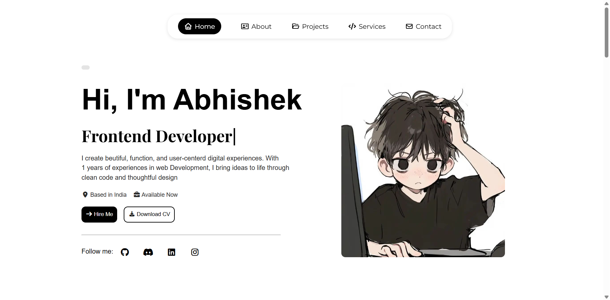
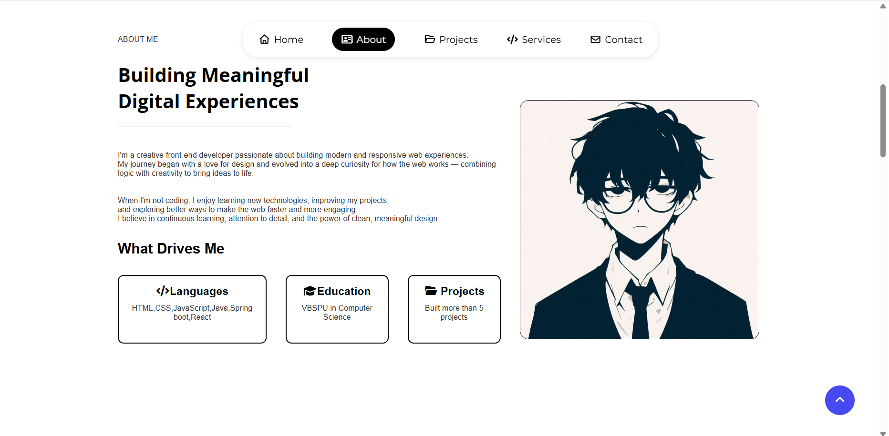
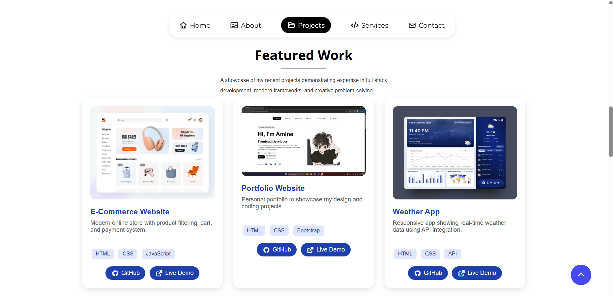
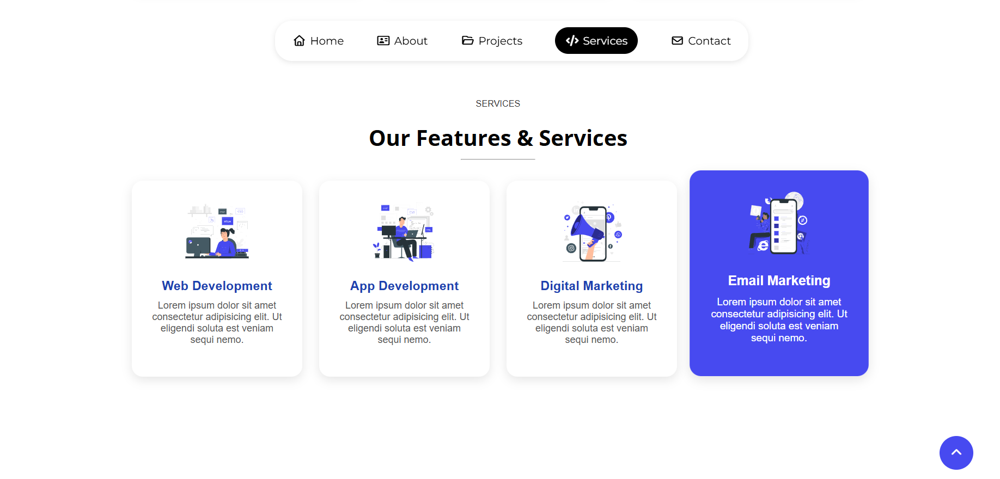
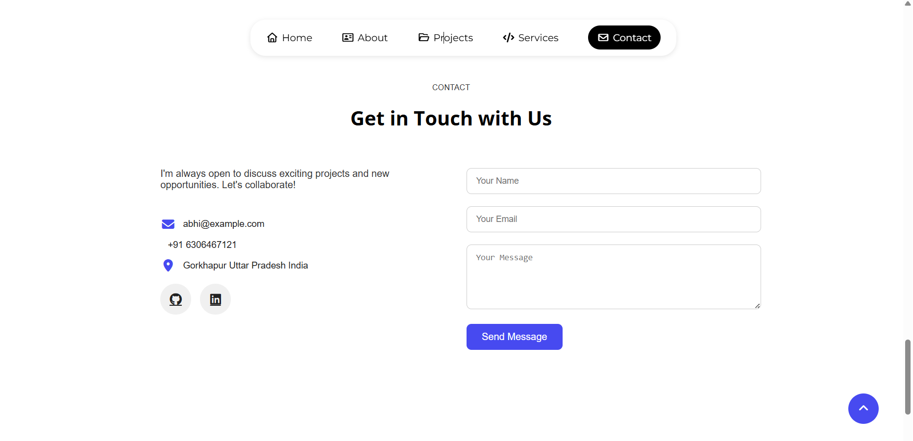

# 🌐 Abhishek's Portfolio Website

A modern, responsive, and visually engaging **portfolio website** built using **HTML, CSS, and JavaScript**.  
It showcases my profile, skills, featured projects, and services as a **Frontend Developer**.  
Designed to create a smooth and elegant user experience with animations, interactive elements, and a clean layout.

---

## 🧠 Features

- 🎨 **Modern UI Design** – Clean, minimal, and responsive layout with smooth transitions.  
- ⚡ **Loading Screen Animation** – Stylish intro animation for a professional first impression.  
- 🧭 **Sticky Navigation Bar** – Highlights active sections as you scroll.  
- 🖋️ **Typing Effect** – Dynamic typing animation to display multiple roles (e.g., Frontend Developer, UI/UX Designer).  
- 💼 **Projects Showcase** – Displays recent works with hover effects and links for GitHub & live demos.  
- 🧩 **Service Section** – Highlights offered web development and design services.  
- ✉️ **Contact Form** – Allows visitors to reach out directly with their message.  
- 📱 **Fully Responsive** – Works seamlessly on desktop, tablet, and mobile devices.  
- ⬆️ **Back to Top Button** – Appears automatically when scrolling down.  

---

## 🛠️ Technologies Used

| Technology | Purpose |
|-------------|----------|
| **HTML5** | Page structure and content |
| **CSS3** | Styling, layout, and animations |
| **JavaScript (ES6)** | Interactivity and dynamic elements |
| **Font Awesome** | Icons and visual elements |
| **Google Fonts** | Typography and design consistency |

---

## 🚀 Project Structure

```
📂 Portfolio/
├── index.html          # Main webpage
├── style.css           # All styles and responsive design
├── main.js             # Animations and interactive scripts
└── images/             # All project and UI images
```

---

## 🧩 Key Sections

- **Home:** Intro with name, role, location, and quick links.  
- **About:** Description of background, passion, and technical skills.  
- **Projects:** Grid-based showcase of featured works with technologies used.  
- **Services:** Overview of what I offer (Web Development, Design, etc.).  
- **Contact:** Contact form and social links for communication.  
- **Footer:** Copyright and social profiles.

---

## 🖼️ Demo Images

Below are some preview screenshots of the portfolio website:

| Home Page | About Section | Projects Showcase |
|------------|----------------|--------------------|
|  |  |  |

| Services Section | Contact Page | Loading Screen |
|------------------|---------------|----------------|
|  |  


---

## 💡 How to Run Locally

1. Clone this repository:
   ```bash
   git clone https://github.com/royalboss444/codealpha_tasks/CodeAlpha_Calculator.git
   ```
2. Open the folder:
   ```bash
   cd portfolio-website
   ```
3. Run the website:
   - Simply open `index.html` in any modern browser.

---

## 🧑‍💻 Author

**Abhishek Singh**  
Frontend Developer & UI Designer  
📍 Based in India  

- 🌐 [LinkedIn](https://www.linkedin.com/in/abhishek-singh-84808738a/)  
- 💻 [GitHub](https://github.com/royalboss444)  


---

## 📜 License

This project is open-source and available under the **MIT License**.

---

⭐ *If you like this project, don’t forget to star the repo!* ⭐
